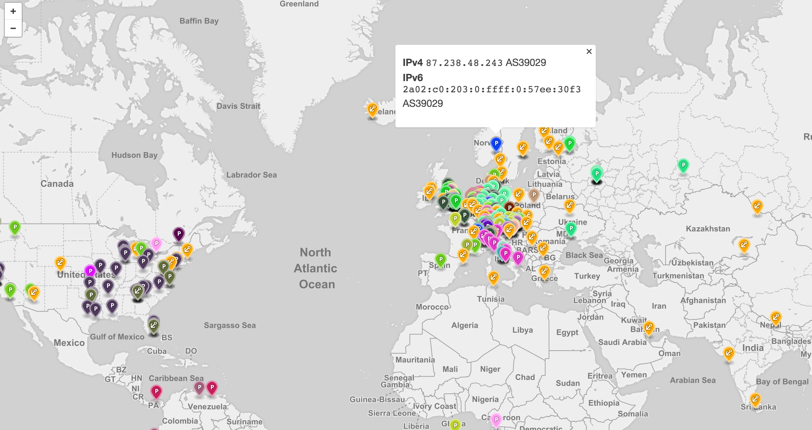

# RIPE NCC Atlas 2015 Hackaton

This tool combines BGP paths with traceroutes from Atlas.

Here, a presentation,
https://speakerdeck.com/0x01/the-ripe-atlas-hackathon-2015

## Building the frontend

OK, so you want to run `gulp` to build the frontend code from `app/src/`
into `dist/`.

	cd app/
	gulp

## Running the backend

Start

	cd app/server
	node server.js

If you want auto reloading, then `npm install -g nodemon`.

	nodemon server.js

## viewing it

Access frontend at `http://localhost:5000/`



## API

Curl/httpie it (`pip install httpie`).

### Anchors

	http 0.0.0.0:5000/anchors

```
[
   {
        "address_v4": "202.52.0.25",
        "address_v6": "2404:2c00:1::25",
        "asn_v4": 45170,
        "asn_v6": 45170,
        "country_code": "NP",
        "id": 6114,
        "is_anchor": true,
        "is_public": true,
        "latitude": 27.709500000000002,
        "longitude": 85.3175,
        "prefix_v4": "202.52.0.0/23",
        "prefix_v6": "2404:2c00::/32",
        "status": 1,
        "status_name": "Connected",
        "status_since": 1427499511,
        "tags": [
            "system-anchor",
            "system-resolves-a-correctly",
            "system-resolves-aaaa-correctly",
            "system-ipv4-works",
            "system-ipv6-doesnt-work"
        ]
    },
	// ...
]
```

This gives GeoJSON output

	http 0.0.0.0:5000/anchors.geojson

### Traceroute startpoints

Regular JSON

	http 0.0.0.0:5000/reach\?q="202.52.0.0/23"

Output structure

```json
	[ {	as: /*AS number*/,
		probes: [
			{ /* Probe */ }
		] } ]
```

Example output

```json
[
   {
       "as": 251,
        "probes": [
            {
                "address_v4": null,
                "address_v6": null,
                "asn_v4": 251,
                "asn_v6": null,
                "country_code": "PL",
                "id": 406,
                "is_anchor": false,
                "is_public": true,
                "latitude": 52.2305,
                "longitude": 20.9975,
                "prefix_v4": "79.141.160.0/24",
                "prefix_v6": null,
                "status": 2,
                "status_name": "Abandoned",
                "status_since": 1418175623,
                "tags": [
                    "no-nat",
                    "system-v1"
                ]
            },
            {
                "asn_v4": 251,
                "asn_v6": null,
                "country_code": "DE",
                "id": 921,
                "is_anchor": false,
                "is_public": false,
                "latitude": 54.4775,
                "longitude": 9.0585,
                "prefix_v4": "79.141.167.0/24",
                "prefix_v6": null,
                "status": 3,
                "status_name": "Abandoned",
                "status_since": 1399565858,
                "tags": [
                    "cable",
                    "home",
                    "nat",
                    "vpn",
                    "system-v1"
                ]
            },
            {
                "asn_v4": 251,
                "asn_v6": 251,
                "country_code": "GB",
                "id": 1187,
                "is_anchor": false,
                "is_public": false,
                "latitude": 51.630500000000005,
                "longitude": -0.7685000000000001,
                "prefix_v4": "95.141.20.0/24",
                "prefix_v6": "2a02:b0::/32",
                "status": 1,
                "status_name": "Connected",
                "status_since": 1427138016,
                "tags": [
                    "system-v1",
                    "system-resolves-a-correctly",
                    "system-resolves-aaaa-correctly",
                    "system-ipv4-works",
                    "system-ipv6-works"
                ]
            }
        ]
    }
]
```

GeoJSON

	http 0.0.0.0:5000/reach\?q="202.52.0.0/23&lat=123"


